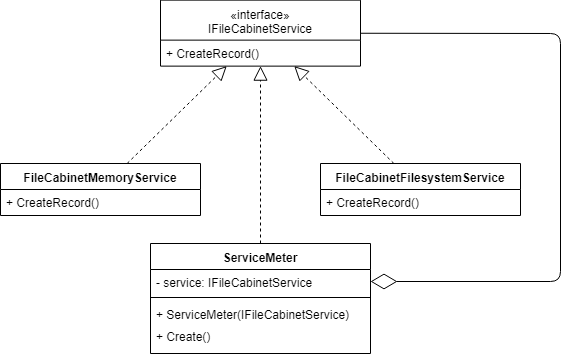
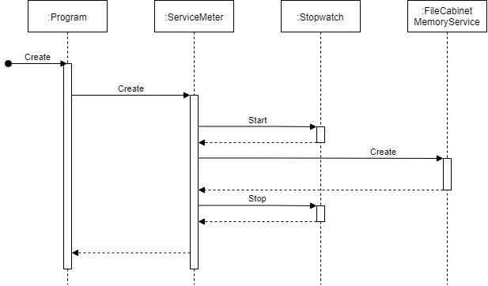

# File Cabinet

## Шаг 11 - Конфигурация и журналирование

Цель: вывод отладочной и дополнительной информации.

Все изменения (commits) должны храниться в ветке _step11-add-config-and-logging_, а после окончания работы должны быть слиты в ветку _master_ (использовать squash-merge).


### Задание

#### Критерии валидации

1. Сохраните текущие критерии валидации в файл _validation-rules.json_.

Пример структуры файла:

```json
{
	"default": {
		"firstName": {
			"min": 2,
			"max": 60
		},
		"lastName": {
			"min": 2,
			"max": 60
		},
		"dateOfBirth": {
			"from": "1/1/1950",
			"to": "10/8/2019"
		}
	},
	"custom": {
		"firstName": {
			"min": 5,
			"max": 80
		},
		"lastName": {
			"min": 5,
			"max": 80
		},
		"dateOfBirth": {
			"from": "1/1/1980",
			"to": "10/8/2019"
		}
	}
}
```

#### Для .NET Core

Реализуйте загрузку критериев валидации из конфигурационного файла с применением [ConfigurationBinder.Get<T>](https://docs.microsoft.com/en-us/dotnet/api/microsoft.extensions.configuration.configurationbinder.get). См. [How to use Configuration API in .net core console application](https://garywoodfine.com/configuration-api-net-core-console-application/).


#### Для .NET Framework

Установите пакет _Newtonsoft.Json_ и реализуйте загрузку параметров через [JsonConvert.DeserializeObject](https://www.newtonsoft.com/json/help/html/SerializationAttributes.htm).


#### Журналирование работы сервиса

Создайте новый класс _ServiceMeter_, который должен измерять время работы методов сервисов и выводить на экран. Реализуйте шаблон [Decorator](https://refactoring.guru/ru/design-patterns/decorator) как показано на диаграмме классов:



Последовательность работы методов класса _ServiceMeter_:



Пример вывода измерения:

```
Create method duration is 384 ticks.
```


#### Журналирование времени работы сервиса